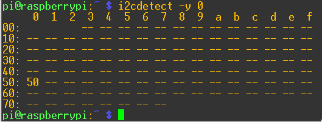
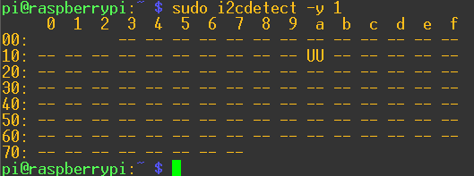
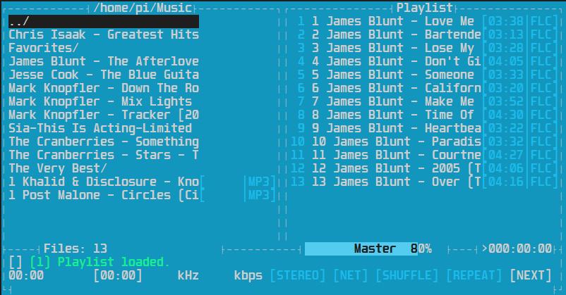
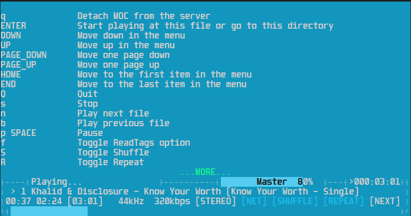

# I2S Audio pHAT
I2S Audio Interface for Raspberry Pi Zero -- by Sergey Kiselev

## Introduction
This is a Raspberry Pi Zero pHAT form-factor I2S audio interface board based on a [Cirrus Logic (Wolfson) WM8731](https://www.cirrus.com/products/wm8731/) audio codec. It provides line input, line output, headphones output, and includes an on-board microphone.

## Hardware Documentation

### Schematic and PCB Layout

[Schematic - Version 3.0](documentation/I2S_Audio_pHAT-Schematic-3.0.pdf)

[PCB Layout - Version 3.0](documentation/I2S_Audio_pHAT-Board-3.0.pdf)

### Bill of Materials

[I2S Audio pHAT project on Mouser.com](https://www.mouser.com/ProjectManager/ProjectDetail.aspx?AccessID=6262cdf84a) - View and order all components except of the PCB.

[I2S Audio pHAT project on OSH Park](https://oshpark.com/shared_projects/yxrgLBxI) - View and order the PCB.

Component type     | Reference | Description                       | Quantity | Possible sources and notes 
------------------ | --------- | --------------------------------- | -------- | --------------------------
PCB                |           | I2S Audio pHAT PCB - Version 3.0  | 1        | Order from [OSH Park](https://oshpark.com/shared_projects/yxrgLBxI)
Integrated Circuit | U1        | WM8731, I2S audio codec, SSOP28   | 1        | Mouser [238-WM8731SEDS/V](https://www.mouser.com/ProductDetail/238-WM8731SEDS-V)
Integrated Circuit | U2        | TPS79333DBVR, LDO, SOT23-5        | 1        | Mouser [595-TPS79333DBVR](https://www.mouser.com/ProductDetail/595-TPS79333DBVR)
Integrated Circuit | U3        | CAT24C32WI-GT3, I2C EEPROM, SOIC8 | 1        | Mouser [698-CAT24C32WI-GT3](https://www.mouser.com/ProductDetail/698-CAT24C32WI-GT3)
Crystal            | X1        | 12.288MHz, 3 mm x 5.3 mm          | 1        | Mouser [717-7A-12.288MAAJ-T](https://www.mouser.com/ProductDetail/717-7A-12288MAAJ-T)
Microphone         | MK1       | 9.7 mm, electret condenser microphone | 1        | Mouser [490-CMA-4544PF-W](https://www.mouser.com/ProductDetail/490-CMA-4544PF-W)
Connector          | P1        | 3.5 mm audio jack, blue           | 1        | Mouser [806-STX-31205B284C](https://www.mouser.com/ProductDetail/806-STX-31205B284C)
Connector          | P2        | 3.5 mm audio jack, green          | 1        | Mouser [806-STX-31205B577C](https://www.mouser.com/ProductDetail/806-STX-31205B577C)
Connector          | P3        | 3.5 mm audio jack, black          | 1        | Mouser [806-STX-3120-5B](https://www.mouser.com/ProductDetail/806-STX-3120-5B)
Connector          | P4        | 20x2, 2.54 mm, socket             | 1        | Mouser [517-929852-01-20-RB](https://www.mouser.com/ProductDetail/517-929852-01-20-RB)
Header             | JP1       | 2x1, 2.54mm, header               | 1        | (optional) Mouser [855-M20-9990245](https://www.mouser.com/ProductDetail/855-M20-9990245)
Capacitor          | C1, C2    | 22pF, 0603                        | 2        | Mouser [77-VJ0603A220JXACBC](https://www.mouser.com/ProductDetail/77-VJ0603A220JXACBC)
Capacitor          | C3-C5     | 220pF, 0603                       | 3        | Mouser [77-VJ0603A221GXAPBC](https://www.mouser.com/ProductDetail/77-VJ0603A221GXAPBC)
Capacitor          | C6        | 0.01uF, 0603                      | 1        | Mouser [77-VJ0603Y103KXACBC](https://www.mouser.com/ProductDetail/77-VJ0603Y103KXACBC)
Capacitor          | C7-C12    | 0.1uF, 0603                       | 6        | Mouser [77-VJ0603Y104JXJPBC](https://www.mouser.com/ProductDetail/77-VJ0603Y104JXJPBC)
Capacitor          | C13-C15   | 1uF, 5 mm, radial                 | 3        | Mouser [647-USW1H010MDD](https://www.mouser.com/ProductDetail/647-USW1H010MDD)
Capacitor          | C16, C17  | 10uF, 5 mm, radial                | 2        | Mouser [647-USW1H100MDD](https://www.mouser.com/ProductDetail/647-USW1H100MDD)
Capacitor          | C18-C21   | 10uF, 0603                        | 4        | Mouser [81-GRM188R61A106KE9D](https://www.mouser.com/ProductDetail/81-GRM188R61A106KE9D)
Capacitor          | C22, C23  | 220uF, 6.3 mm, radial             | 2        | Mouser [647-USW0J221MDD](https://www.mouser.com/ProductDetail/647-USW0J221MDD)
Resistor           | R1-R6     | 33 ohm, 0603                      | 6        | Mouser [603-RC0603FR-0733RL](https://www.mouser.com/ProductDetail/603-RC0603FR-0733RL)
Resistor           | R7, R8    | 100 ohm, 0603                     | 2        | Mouser [603-RC0603FR-07100RL](https://www.mouser.com/ProductDetail/603-RC0603FR-07100RL)
Resistor           | R9        | 330 ohm, 0603                     | 1        | Mouser [603-RC0603FR-07330RL](https://www.mouser.com/ProductDetail/603-RC0603FR-07330RL)
Resistor           | R10       | 680 ohm, 0603                     | 1        | Mouser [603-RC0603FR-07680RL](https://www.mouser.com/ProductDetail/603-RC0603FR-07680RL)
Resistor           | R11       | 1 kohm, 0603                      | 1        | Mouser [603-RC0603FR-071KL](https://www.mouser.com/ProductDetail/603-RC0603FR-071KL)
Resistor           | R12, R13  | 3.9 kohm, 0603                    | 2        | Mouser [603-RC0603FR-073K9L](https://www.mouser.com/ProductDetail/603-RC0603FR-073K9L)
Resistor           | R14-R18   | 5.6 kohm, 0603                    | 5        | Mouser [603-RC0603FR-075K6L](https://www.mouser.com/ProductDetail/603-RC0603FR-075K6L)
Resistor           | R19-R22   | 47 kohm, 0603                     | 4        | Mouser [603-RC0603FR-0747KL](https://www.mouser.com/ProductDetail/603-RC0603FR-0747KL)

## Software Documentation

### Raspbian Configuration

Open `/boot/config.txt` in your favorite editor (nano, vi) as root, for example:

    sudo nano /boot/config.txt

Comment out the `dtparam=audio=on` line:

    # Enable audio (loads snd_bcm2835)
    #dtparam=audio=on

When using I2S Audio pHAT _without_ ID EEPROM (see [Raspberry Pi HAT ID EEPROM Programming](#raspberry-pi-hat-id-eeprom-programming) section below), add the following lines:

    # Enable WM8731 codec
    # enable I2C bus for HAT (i2c0)
    dtoverlay=i2c0
    dtparam=i2c_arm=on
    dtparam=i2s=on
    dtoverlay=i2s-mmap
    dtoverlay=rpi-proto

Save the file and reboot the system.

Start `alsamixer`. If the I2S Audio pHAT is detected properly, it should show _Card: snd_rpi_proto_ on the top left. Also use this opportunity to unmute *Output Mixer HiFi* control, otherwise the codec will not play any sound. To do so, use cursor keys to highlight that control, and then press the *M* key to unmute it.

When recording the sound, switch to *Capture* controls in `alsamixer` by pressing the *F4* key. Next select the capture source: *Line* or *Mic*, and unmute it by pressing the *Space* key.

Now you can use your favorite application to play music or record sound. Enjoy!

### Raspberry Pi HAT ID EEPROM Programming

The I2S Audio pHAT includes an ID EEPROM as specified by HAT requirements. This ID EEPROM allows Raspberry OS to automatically detect the I2S Audio pHAT, add it to the device tree, and load approprate overlays and kernel modules. Follow the instructions below to program the EEPROM.
Install dependencies software, if needed:

    sudo apt-get install -y i2c-tools device-tree-compiler

Check to see if EEPROM is on i2c bus 0:
    
    (Note - to enable bus 0 you need to add 'dtparam=i2c_vc=on' in your /boot/config.txt)

    pi@raspberrypi:~ $ i2cdetect -y 0

Check to see if WM8731 shows on i2c bus 1:
    
    (Note  - 'UU' means a driver has been loaded for the chip already, otherwise 1A address will show)

    pi@raspberrypi:~ $ i2cdetect -y 1

Clone the Raspberry Pi [hats](https://github.com/raspberrypi/hats) repostory from GitHub:

    git clone https://github.com/raspberrypi/hats

Clone the [I2S Audio pHAT](https://github.com/skiselev/i2s_audio_phat) repository from GitHub:

    git clone https://github.com/cghercoias/i2s_audio_phat

Build the `eepromutils` in the `hats` repository:

    cd hats/eepromutils
    make

Create the `i2s_audio_phat.eep` ID EEPROM image, using the `eeprom_settings_i2s_audio_phat.txt` file provided in the `i2s_audio_phat` repository:

    ./eepmake ../../i2s_audio_phat/eeprom_settings_i2s_audio_phat.txt i2s_audio_phat.eep /boot/overlays/rpi-proto.dtbo

Finally, flash the `i2s_audio_phat.eep` ID EEPROM image to the EEPROM. 
Make sure to close the `JP1` jumper on the `I2S Audio pHAT` before writing the EEPROM, for example using male to male jumper wire, or otherwise the write will fail.

    sudo ./eepflash.sh -w -f=i2s_audio_phat.eep -t=24c32

### Testing Audio

Disable built-in RaspberryPi audio. 
Open `/boot/config.txt` in your favorite editor (`nano` or `vi`) as `root`:

    sudo nano /boot/config.txt

Comment out the `dtparam=audio=on` line:

    # Enable audio (loads snd_bcm2835)
    # dtparam=audio=on
    

## Using MOC

Install `MOC`-- (Music On Console) is a console audio player for LINUX/UNIX designed to be powerful and easy to use.
MOC plays smoothly, regardless of system or I/O load because it uses the output buffer in a separate thread. 
It provides gapless playback because the next file to be played is precached while the current file is playing.

    pi@raspberrypi:~ $ sudo apt install -y moc

Place your music in a directory (i.e. `/home/pi/Music/`), then launch `mocp`

    pi@raspberrypi:~ $ mocp
    

    
`ENTER`          Start playing at this file or go to this directory
`DOWN`           Move down in the menu
`UP`             Move up in the menu
`<`              Decrease volume by 1%
`>`              Increase volume by 1%
`,`              Decrease volume by 5%
`.`              Increase volume by 5%
`RIGHT`          Seek forward by n-s
`LEFT`           Seek backward by n-s

## Use `h` to access the `help` page for extended commands:

